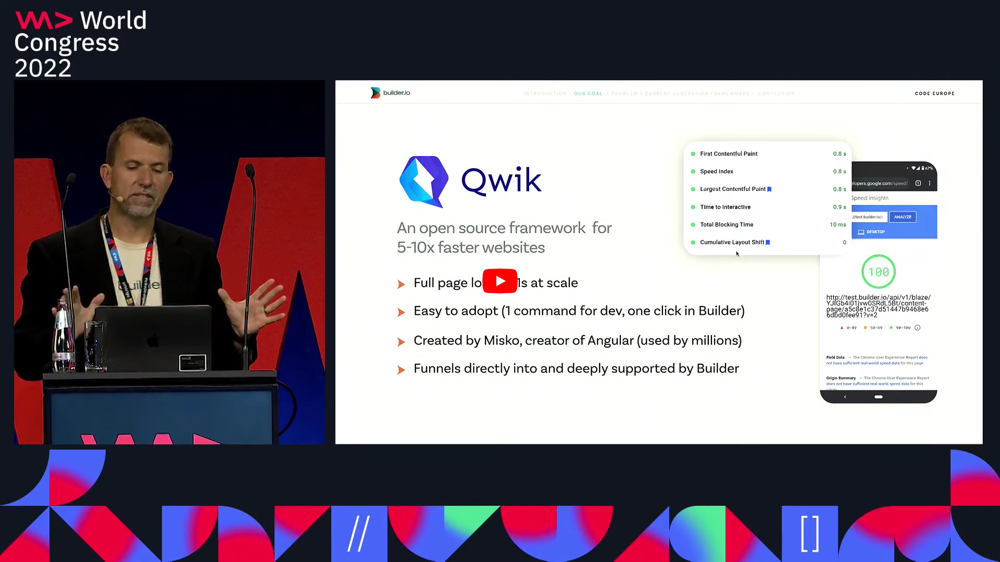

<br />

<p align="center">
  
</p>

<a href="https://youtu.be/0dC11DMR3fU?t=154">
  
</a>

# The HTML-first framework

Qwik offers the fastest possible page load times - regardless of the complexity of your website. Qwik is so fast because it allows fully interactive sites to load with almost no JavaScript and [pickup from where the server left off](https://github.com/BuilderIO/qwik/blob/main/packages/docs/src/routes/docs/concepts/resumable/index.mdx).

As users interact with the site, only the necesary parts of the site load on-demand. This [precision lazy-loading](https://github.com/BuilderIO/qwik/blob/main/packages/docs/src/routes/docs/concepts/progressive/index.mdx) is what makes Qwik so quick.

## Getting Started

Try out our starter:

```bash
npm create qwik@latest
```

- Understand the difference between [resumable and replayable](https://github.com/BuilderIO/qwik/blob/main/packages/docs/src/routes/docs/concepts/resumable/index.mdx) applications.
- Learn about Qwik's high level [mental model](https://github.com/BuilderIO/qwik/blob/main/packages/docs/src/routes/docs/think-qwik/index.mdx).

## Docs

- [Official Docs](https://qwik.builder.io/)

## Blog Posts

- [HTML-first, JavaScript last: the secret to web speed!](https://dev.to/mhevery/html-first-javascript-last-the-secret-to-web-speed-4ic9)
- [A first look at Qwik - the HTML first framework](https://dev.to/mhevery/a-first-look-at-qwik-the-html-first-framework-af)
- [Death by Closure (and how Qwik solves it)](https://dev.to/mhevery/death-by-closure-and-how-qwik-solves-it-44jj)
- [Qwik: the answer to optimal fine-grained lazy loading](https://dev.to/mhevery/qwik-the-answer-to-optimal-fine-grained-lazy-loading-2hdp)

## Development

- See [Contributing.md](https://github.com/BuilderIO/qwik/blob/main/CONTRIBUTING.md) for more information on how to build Qwik from the source and contribute!

## Community

- Ping us at [@QwikDev](https://twitter.com/QwikDev)
- Join our [Discord](https://qwik.builder.io/chat) community
- Join all the [other community groups](https://qwikcommunity.com)

## Related

- [Partytown](https://partytown.builder.io/): Relocate resource intensive third-party scripts off of the main thread and into a web worker 🎉.
- [Mitosis](https://github.com/BuilderIO/mitosis): Write components once, run everywhere. Compiles to Vue, React, Solid, Angular, Svelte, and more.
- [Builder](https://github.com/BuilderIO/builder): Drag and drop page builder and CMS for React, Vue, Angular, and more.

---

<p align="center">
  Made with ❤️ by <a target="_blank" href="https://www.builder.io/">Builder.io</a>
</p>
