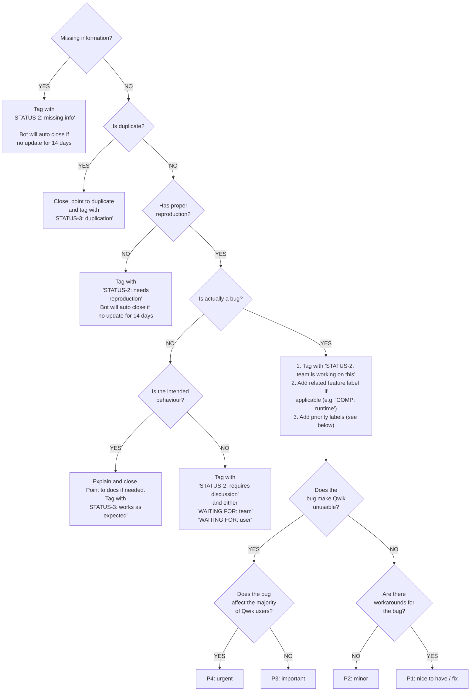
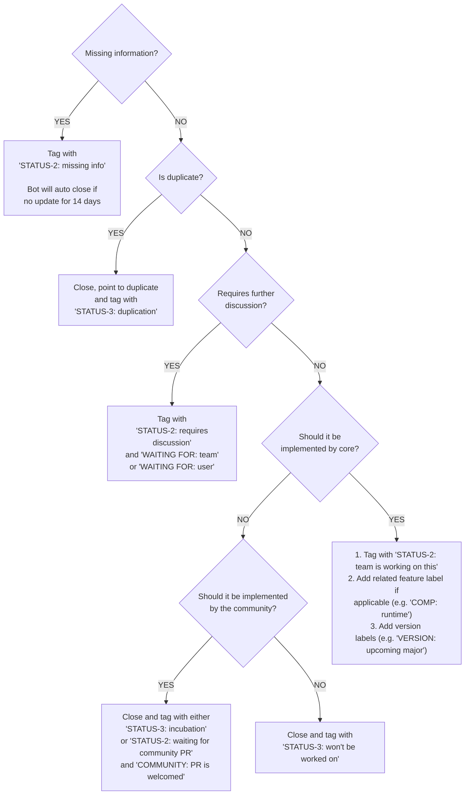

# Triage Titans Guide

Hey there! Welcome to the wild world of the **Triage Titans**, where we tame bugs and nurture enhancements with the precision of true repository doctors.

Let's keep the code healthy, the project smooth, and have some fun along the way.

## Note about tags prefixes:

1. **STATUS-1**: The initial `needs triage` gets automatically added to newly created issues
2. **STATUS-2**: A "waiting for someone/something" status.
3. **STATUS-3**: The final state of an issue. This is a "resolution" status.

---

👇 _Inspiration for the diagrams below came from the Vite project_

## Bug Triaging Process

Our bug triaging process makes sure every reported issue gets the attention it deserves. We categorize, prioritize, and assign bugs to the right person to squash them quickly.

Here's how the Triage Titans handle bug reports in the Qwik repository:

---

## Enhancement Triaging Process

Alright, Triage Titans! Somebody got a cool new feature idea or an awesome improvement to boost Qwik?

It's our job to make sure these enhancements are properly evaluated, prioritized, and brought to life.

What helps the team to prioritize work is the number of 👍 votes by the community on a specific issue.

### A note about enhancements to the core:

We are very careful about which features we introduce into the Qwik core, because we know that every new feature adds complexity and maintenance tasks to the codebase.

Every feature is being carefully evaluated based on our vision and philosophy of "automatic optimization".

That's why we'll often encourage the community to implement a certain feature and evaluate its adoption over time to see if it should actually be part of the core.

.

Now, let's dive into how we handle enhancement requests in the Qwik repository:

## Thank You!

A big shoutout to all our amazing contributors and Triage Titans! Your dedication, creativity, and hard work help keep Qwik running smoothly and evolving with exciting new features. We wouldn't be able to do it without you 🫶

Thank you for being a part of our journey and making Qwik awesome. Keep up the great work, and let's continue building something amazing together!
