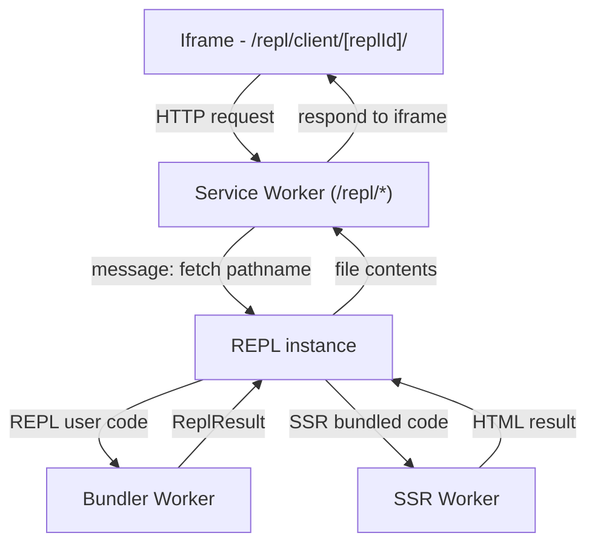

# Qwik Docs REPL

This folder contains the client-side REPL (Read-Eval-Print Loop) used in the Qwik docs site. The REPL lets users write and run Qwik/TypeScript code snippets in the browser, see results, and share runnable examples.

This README gives a high-level overview of how the REPL is structured, what each area is responsible for, and some development notes and suggested improvements.

---

## High-level architecture

The REPL is a browser-first system composed of three main parts:

- Bundler subsystem (web-worker + helpers): transforms user code, resolves imports, bundles modules, and prepares runnable artifacts.
- Service worker: Intercepts requests to `/repl/` and messages the bundler subsystem (via BroadcastChannel) to get responses. This allows the REPL to work without a server.
- UI (React/Qwik components + Monaco): editor, panels, console, options and controls that let users edit code and view outputs.

The codebase keeps bundling and heavy work off the main thread by using a web worker script per Qwik version.

## Key directories & files

- `repl-sw.ts` and `register-repl-sw.ts`
  - Service worker script and registration helper. The script is actually served via the route `/src/routes/repl/repl-sw.js/entry.ts`, which becomes the served path `/repl/repl-sw.js`.

- `bundler/`
  - `bundled.tsx` — provides the current development version of Qwik, so that the REPL can show the latest features, and it can work while developing offline.
  - `bundler-registry.ts` — maintains the per-version Qwik WebWorkers.
  - `bundler-worker.ts` — bundles and runs the REPL user code.
  - `repl-ssr-worker.ts` — executes the SSR bundle in a separate worker served from `/repl/`, so that the imports can be intercepted by the service worker.

- `ui/`
  - `repl-instance.ts` — orchestration or single-instance logic for a REPL embed on a page.
  - `editor.tsx`, `monaco.tsx` — Monaco editor wiring and editor UI glue.
  - `repl-*.tsx` — UI components for console, input/output panels, tabs, share URL, version display, etc.

## How it works

1. The UI component (`ui/editor.tsx` + `ui/monaco.tsx`) presents a code editor and controls.
2. When code is executed, the bundler subsystem is invoked. The UI posts a message to the bundler worker.
3. The bundler worker (`bundler-worker.ts`) makes the client and SSR bundles, and executes `render()` from the `entry.ssr` to get the SSR result HTML.
4. The UI also shows an iframe, loading `/repl/client/[id]/`.
5. The service worker intercepts all requests and uses messages to get the bundle + html files from the worker.

### Flow diagram

- The iframe requests `/repl/client/[id]/`
- The service worker intercepts and sends a message to the REPL instance
- The REPL instance messages the bundler to bundle the user code
- The bundler messages the REPL instance with the result
- The REPL instance then runs the SSR bundle in a separate worker, again with messages
- The REPL instance messages the service worker with the requested file
- The service worker fulfills the request



## Running the REPL

The REPL is part of the docs site — start the docs dev server (project root):

```bash
pnpm docs.dev
```

Then visit `/playground`.
