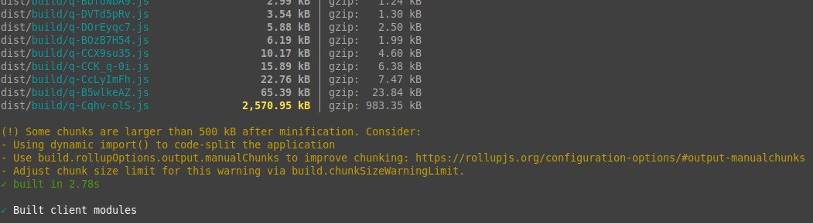
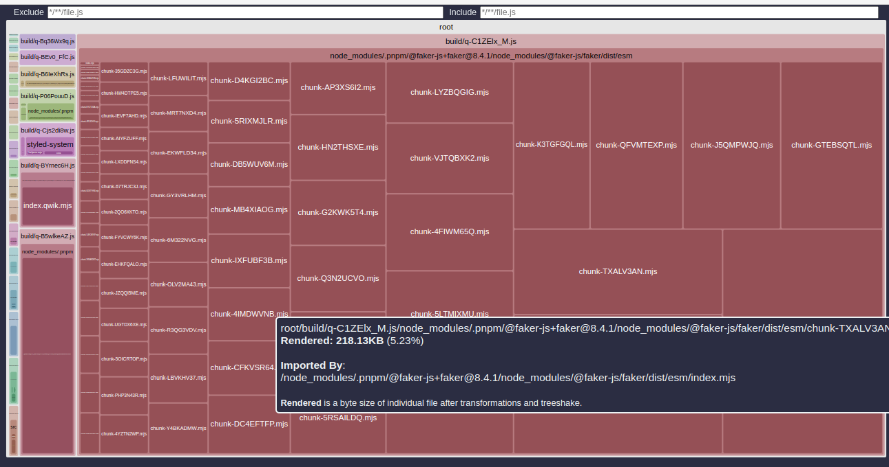

import PackageManagerTabs from '~/components/package-manager-tabs/index.tsx';

# Debugging Qwik

Debugging web applications can be a challenge, but fear not! This guide will provide you with some helpful tips and tricks to help you debug your Qwik application.

## Debug Big JS Chunks

Sometimes you might notice when you build your application or preview it, Vite and Rollup will output a notice complaining about large chunks of code being generated.

```
(!) Some chunks are larger than 500 kB after minification. Consider:
- Using dynamic import() to code-split the application
- Use build.rollupOptions.output.manualChunks to improve chunking: https://rollupjs.org/configuration-options/#output-manualchunks
- Adjust chunk size limit for this warning via build.chunkSizeWarningLimit.
```

In simple terms, something you import or use in your project is probably way too big, and is not been split into smaller chunks.
And will outperform when you send it to the client.

First you will notice is that the chunk names are not very helpful to identify the plug-in or library or file that is causing the issue.

Because it's minified.
[]


### rollup-plugin-visualizer

This plugin is a tool that will help you visualize the size of your chunks in a very simple html file.
First Install the plugin:

<PackageManagerTabs>
<span q:slot="pnpm">
```shell
pnpm add -D rollup-plugin-visualizer
```
</span>
<span q:slot="npm">
```shell
npm install --save-dev rollup-plugin-visualizer
```
</span>
<span q:slot="yarn">
```shell
yarn add --dev rollup-plugin-visualizer
```
</span>
</PackageManagerTabs>

Second, edit your `vite.config.ts` file to include the plugin:

```ts
// Import the plugin and types
import { type PluginOption } from 'vite'
import { visualizer } from "rollup-plugin-visualizer";

// Add the plugin to the plugins array
plugins: [
      ...
      visualizer() as PluginOption
  ]

```

Third, run your build or preview the same way you normally do.

This will create a new file in the root of your project called `stats.html` that you can open in your browser.

The file will contain a visualization of the size of your chunks, and you can see which file is causing the issue.

[]

In the example above, we can see that `faker` library is causing the issue.