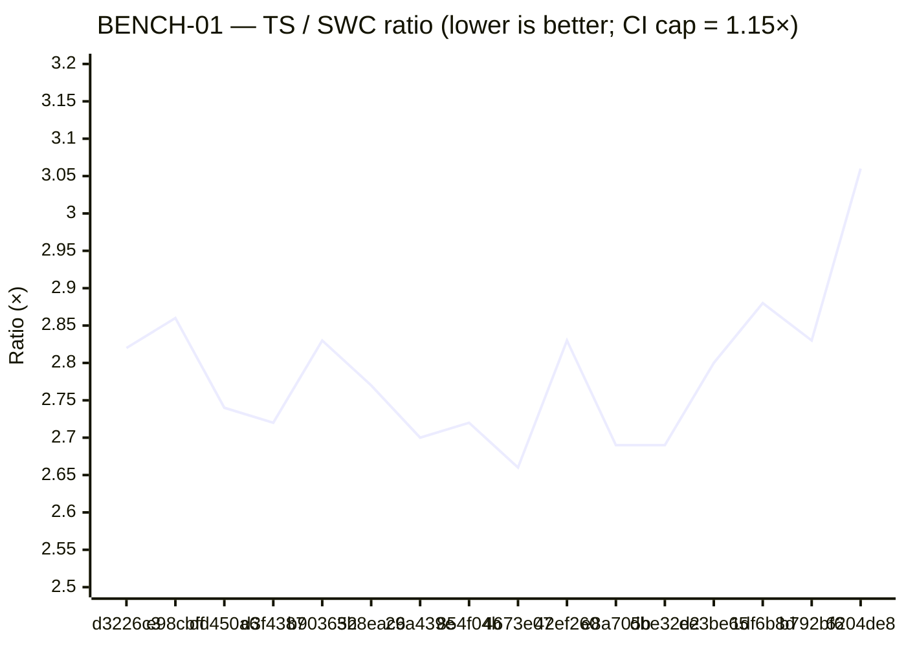
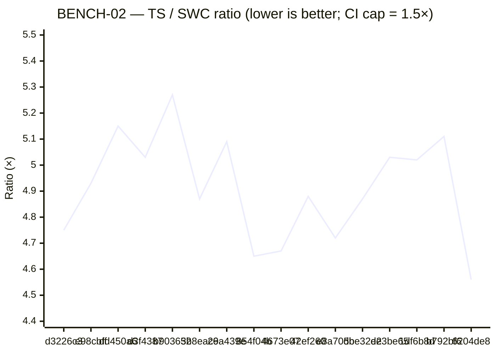

# Performance Benchmark History

Wall-time perf comparison of the TypeScript optimizer (this repo) against the SWC reference (`@qwik.dev/optimizer`'s NAPI binding). Use this doc to spot regressions and to track whether perf-targeted work is moving the needle.

The numbers come from `tests/benchmark/optimizer-benchmark.test.ts`. Append a row whenever you've shipped (or are about to ship) a change that could plausibly affect throughput.

---

## What's measured

Two benchmarks defined in `tests/benchmark/optimizer-benchmark.test.ts`, both running over real Qwik source:

| Benchmark | Input | Description |
|---|---|---|
| **BENCH-01** | `$QWIK_HOME/packages/**/*.{ts,tsx,js,jsx}` (excluding `node_modules`/`dist`/`.turbo`) — currently ~1391 files | "Whole monorepo" pass — exercises file-discovery + per-file batching cost |
| **BENCH-02** | `$QWIK_HOME/packages/qwik/src/core/tests/component.spec.tsx` — 3860 lines | Worst-case single file — a heavy component-spec that stresses extraction + segment generation |

Each benchmark warms up once, then takes the **min wall-time** across `MEASURED_RUNS = 2` measured runs. The `Ratio` column is `TS time ÷ SWC time`.

The current CI assertion caps are **1.15×** for BENCH-01 and **1.5×** for BENCH-02 — neither has been hit yet (see "Trend so far" below).

---

## How to add a new data point

1. Make sure the SWC reference binding is fresh:
   ```
   cd "$QWIK_HOME" && pnpm build.platform
   ```
   This rebuilds `$QWIK_HOME/packages/optimizer/bindings/qwik.<platform-arch>.node`. Skip if the qwik checkout hasn't moved since your last run.

2. From this repo:
   ```
   BENCH=1 pnpm vitest run tests/benchmark/optimizer-benchmark.test.ts --no-file-parallelism
   ```

3. Both benchmarks will print `SWC time:`, `TS time:`, and `Ratio:` lines. Both will assertion-fail (the caps haven't been met) — that's expected; the goal is to capture the numbers, not pass.

4. Prepend a row to each table below with: date, the merge SHA your numbers describe, a short workstream label, the three numbers, and any notes.

5. If your run targeted perf, append a one-line entry to the **"Trend so far"** section explaining what moved.

> **If the SWC binding was rebuilt against a different qwik commit since the last row,** note this in the Notes column. Both numerator and denominator change in that case, so SWC and TS times across rows are no longer apples-to-apples — only Ratio remains comparable.

---

## Methodology caveats

- **Numbers carry ~5–15% machine-state variance.** Running the same commit twice on the same machine produced 1465ms vs 1526ms on BENCH-01 (4% spread) and 91ms vs 96ms on BENCH-02 (5% spread). Don't read narrow row-to-row deltas as signal — only deltas that hold across multiple runs, or that exceed the variance band, mean anything.
- The reference SWC binding is rebuilt rarely; SWC times across rows are expected to be roughly constant at ~550ms for BENCH-01 and ~20ms for BENCH-02. **TS times are the meaningful axis.**
- Measurements are taken on `darwin-arm64` (Apple M-series). Other platforms will have different absolute timings — ratios should be roughly comparable. If you add a row from a different platform, mark it in the Notes column.
- The benchmark does *not* isolate CPU governor, freeze interrupts, or pin to performance cores. It's a quick wall-time check, not a microbenchmark. For perf-targeted work, run the benchmark several times and take the minimum.

---

## BENCH-01 — Full monorepo (~1391 files)

| Date | Commit | Workstream | SWC ms | TS ms | Ratio | Notes |
|---|---|---|---|---|---|---|
| **2026-06-11** | **OSS-496 branch** | **Phase-1 extraction fused into the gather walk + marker prefilter** | 568 | 1346 | **2.42×** | Interleaved same-session pairs (3×): branch 1346–1368ms vs `main` 1370–1477ms — consistent direction every pair, **−1.7% min wall** (at the variance edge, not over-claimed). An intermediate fusion-only build measured **+5%** (non-trigger modules newly paying tracker + buffers); the marker prefilter + lazy lexical frames + zero-extraction classification/scope-entry skips clawed it back below `main`. Census: walks 1,999 → **826** (−58.7%); trigger + jsx-only at 1 walk/module, 565/783 passthrough modules skip the walk entirely. Pre-merge SHA. |
| **2026-06-11** | **OSS-495 branch** | **ScopeTracker builds during the gather walk (build walk deleted)** | 553 | 1343 | **2.43×** | Min of 3 (1343–1414ms, 2.43–2.59×). Same-session `main`: 1366–1401ms, 2.48–2.54× — bands overlap, **within variance** (spike projected ≈neutral: eliminated-walk savings ~28ms vs ~16ms new unconditional bookkeeping). The win is the census: total program walks 2,477 → 1,999 (−19.3%); trigger modules 3 → 2 walks (478 standalone build walks gone). Pre-merge SHA. |
| **2026-06-11** | **OSS-491 branch** | **Phase-0.5 flatten prefilter + lazy MagicString** | 563 | 1387 | **2.46×** | Min of 3 (1387–1456ms, 2.46–2.58×). Same-session `main`: 1410–1431ms, 2.51–2.53× — bands overlap, **within variance**. The win is the census: monorepo Phase-0.5 walks 1,391 → 485 (−65%), MagicString ctors 1,391 → 12 (−99%). Pre-merge SHA. |
| **2026-06-11** | **OSS-490 branch** | **MagicString churn: JSX write memo + lazy session edits + skip-range index** | 562 | 1428 | **2.54×** | Min of 3 (1428–1445ms, 2.54–2.62×). Same-session `main`: 1487–1496ms, 2.63–2.66× — bands don't overlap; **−4.0% TS wall**. Pre-merge SHA. |
| **2026-06-11** | **OSS-489 branch** | **session churn: combined field-map extractor + memo cap 16 + w-call prefilter** | 554 | 1454 | **2.62×** | Min of 3 (1454–1486ms, 2.62–2.72×). Same-session `main`: 1464–1495ms, 2.69–2.72× — bands overlap, **within variance** (session parses were ~5% of self-time). The win is the census: monorepo session parses 6,289 → 5,646 (−10.2%), sessions 13,428 → 12,502. |
| **2026-06-10** | **OSS-488 branch** | **scope-bindings walk fused into gather walk** | 553 | 1456 | **2.63×** | Min of 3 (1456–1568ms, 2.63–2.85×). Same-session `main`: 1474–1600ms, 2.69–2.91× — bands overlap, **within variance** (as the ticket predicted for one walk per module). The win is the census: standalone bindings walks 1,994 → 1,404 (−590, one per parent JSX module). Pre-merge SHA. |
| **2026-06-10** | **OSS-487 branch** | **perf micros: segment-usage sweep + wireMigration subtree walk + regex hoists** | 549 | 1482 | **2.69×** | Min of 3 (1482–1495ms, 2.69–2.72×). Same-session `main`: 1528–1609ms, 2.80–2.91× — −3% TS wall, at the variance edge; not claimed as a win. Pre-merge SHA. |
| **2026-06-10** | **OSS-486 step-2 branch** | **group-2 session threading (parse memo + canonical wrapper)** | 548 | 1623 | **2.96×** | First wall movement of the track: all 3 runs (2.94–3.00×) below the baseline band (3.04–3.08×). Parses −47% (18,109 → 9,572 mono). Pre-merge SHA. |
| **2026-06-10** | **OSS-486 step-1 branch (PR #261)** | **group-1 walk fusion (`computeClosureFreeIdentifiers`)** | 550 | 1684 | **3.06×** | Wall-neutral (min of 3: 1684–1718ms). Walk invocations −35% (30,344 → 19,824 mono); the eliminated walks were closure-subtree-sized, so count ≠ wall. Pre-merge SHA. |
| **2026-06-10** | **`6204de8`** | **post #257 — OSS-485 fix; Track D baseline** | 546 | 1674 | **3.06×** | First measurable BENCH-01 run since 2026-05-13 (OSS-485's whole-buffer-overwrite crash blocked it). Min of 3 runs (TS 1674–1687ms, ratio 3.04–3.08×). ~7% TS-wall growth vs the last row is accumulated feature-work cost — see "Update 2026-06-10". |
| **2026-05-13** | **`b792bf6`** | **PR #56 branch HEAD — post-OSS-365 + F8c crash fix** | 552 | 1568 | **2.83×** | code-health #2: shared AST across module-cleanup post-process pipeline + substring re-parse eliminated. Includes flatten-destructures crash fix. Pre-merge — SHA will change on squash. |
| 2026-05-13 | `1df6b8d` | post #54 — OSS-364 | 547 | 1576 | 2.88× | code-health #1: event-capture-promotion walks 5→2 via pre-collection. Crash fix applied for measurement (same fix as the b792bf6 row). |
| 2026-05-13 | `ee3be65` | post #52 — F8c / OSS-363 | 552 | 1549 | 2.80× | F8c: new `flatten-destructures.ts` Phase 0.5 step + rawProps gate + compound-destructure const classification. Crash fix applied for measurement (BENCH-01 crashes on plain HEAD due to the magic-string overwrite bug). |
| 2026-05-09 | `dbe32d2` | post #36 — pre-F1b/F8/code-health | 549 | 1475 | **2.69×** | post-Sub-C — refactor track v2 fully closed; orchestrator at 34 lines |
| 2026-05-09 | `e8a705b` | post #34 — OSS-357 (Sub-B) | 552 | 1485 | 2.69× | migration-wiring + nested call-sites + nested QRL decls extracted |
| 2026-05-09 | `42ef260` | post #32 — OSS-356 (Sub-A) | 548 | 1549 | 2.83× | Prep + inline-strategy + shared rawProps helper extracted (single noisy run; Sub-B + Sub-C re-stabilise) |
| 2026-05-09 | `4673e07` | post #27 — pre-track-v2 baseline | 550 | 1465 | 2.66× | post-OSS-355 + post-merge-routine codification |
| 2026-05-09 | `854f04b` | post #23 — OSS-354 | 557 | 1514 | 2.72× | closure-form `resolveConstLiterals` + prod-rename sync |
| 2026-05-08 | `29a439e` | post #22 — OSS-353 | 582 | 1571 | 2.70× | closure-node threading; per-extraction body re-parse dropped |
| 2026-05-08 | `3b8eac6` | post #18 — OSS-350 | 574 | 1589 | 2.77× | `preParsedModule` plumbing — single shared parse |
| 2026-05-08 | `b903652` | post #14 — OSS-346 | 571 | 1618 | 2.83× | `generateSegmentCode` 9-phase sequencer extracted |
| 2026-05-07 | `d3f4387` | post #11 — OSS-340 | 575 | 1567 | 2.72× | refactor v1 close — predicates module |
| 2026-05-07 | `dd450a6` | post #7 — OSS-341 | 574 | 1572 | 2.74× | CI infrastructure landed |
| 2026-05-07 | `e98cbff` | post #5 — F1 fix | 572 | 1635 | 2.86× | first TS optimizer code change — `_ref` indirection |
| 2026-05-06 | `d3226c3` | pre-code baseline | 553 | 1558 | 2.82× | "Group All Convergence Failures" — last commit before code work |

## BENCH-02 — Worst-case single file (`component.spec.tsx`, 3860 lines)

| Date | Commit | Workstream | SWC ms | TS ms | Ratio | Notes |
|---|---|---|---|---|---|---|
| **2026-06-11** | **OSS-496 branch** | **Phase-1 extraction fused into the gather walk + marker prefilter** | 19 | 65 | **3.28×** | Interleaved same-session pairs (3×): branch 65–73ms vs `main` 67–69ms — bands overlap, **within variance** (the worst-case file is a single trigger module: its two walks become one, but handler work dominates traversal on one file). Pre-merge SHA. |
| **2026-06-11** | **OSS-495 branch** | **ScopeTracker builds during the gather walk (build walk deleted)** | 19 | 63 | **3.21×** | Min of 3 (63–71ms, 3.21–3.63×). Same-session `main`: 66–69ms, 3.31–3.47× — bands overlap, **within variance** (one eliminated walk on a single trigger file is below the noise floor). Pre-merge SHA. |
| **2026-06-11** | **OSS-491 branch** | **Phase-0.5 flatten prefilter + lazy MagicString** | 20 | 64 | **3.20×** | Min of 3 (64–67ms, 3.20–3.30×). Same-session `main`: 65–68ms, 3.33–3.42× — bands overlap, **within variance**, as the ticket predicted (the worst-case file is `component$`-dense, so its walk survives the prefilter; only the per-module ctor is saved). 30-iter harness identical (2132 vs 2124ms). Pre-merge SHA. |
| **2026-06-11** | **OSS-490 branch** | **MagicString churn: JSX write memo + lazy session edits + skip-range index** | 19 | 64 | **3.28×** | Min of 3 (64–66ms, 3.28–3.42×). Same-session `main`: 74–78ms, 3.93–3.99× — bands clearly separate; **−13.5% min wall**, matching the ~13% combined self-time the profile attributed to the three fixed sites. 30-iter harness: 2375 → 2108ms (−11.2%). Pre-merge SHA. |
| **2026-06-11** | **OSS-489 branch** | **session churn: combined field-map extractor + memo cap 16 + w-call prefilter** | 21 | 72 | **3.48×** | Min of 3 (72–76ms, 3.48–4.01×). Same-session `main`: 75ms ×3 (3.78–3.95×) — bands overlap, **within variance**. Worst-case file: session misses 487 → 417 (−14%), cap-eviction waste 80 → 10; the residual 407 are one-shot parses of genuinely distinct text versions (the architecture's floor without batching). |
| **2026-06-10** | **OSS-488 branch** | **scope-bindings walk fused into gather walk** | 20 | 75 | **3.72×** | Min of 3 (75–79ms, 3.72–4.31×). Same-session `main`: 76–82ms, 3.99–4.14× — bands overlap, **within variance**, expected: the per-segment bindings walks are untouched (each runs once per body; no duplication to eliminate — see OSS-488's segment-side verdict). |
| **2026-06-10** | **OSS-487 branch** | **perf micros: segment-usage sweep + wireMigration subtree walk + regex hoists** | 20 | 75 | **3.83×** | Min of 3 (75–79ms, 3.83–4.09×). Same-session `main`: 80–84ms, 4.29–4.38× — bands don't overlap; −6% min wall matches the 2026-06-10 profile's combined inclusive share for the two fixed sites on this shape (segment-usage 4.2% + wireMigration 2.3%). |
| **2026-06-10** | **OSS-486 step-2 branch** | **group-2 session threading (parse memo + canonical wrapper)** | 20 | 87 | **4.34×** | Parses −50% on this file (1,191 → 596). 30-iteration harness: 2,842 → 2,668ms (−6%; −9% cumulative from the Track D baseline). |
| **2026-06-10** | **OSS-486 step-1 branch (PR #261)** | **group-1 walk fusion (`computeClosureFreeIdentifiers`)** | 20 | 90 | **4.62×** | Wall-neutral (min of 3: 90–96ms; 30-iteration harness shows ~−3%, at the noise edge). Walk invocations −52% on this file (1,706 → 812). Pre-merge SHA. |
| **2026-06-10** | **`6204de8`** | **post #257 — OSS-485 fix; Track D baseline** | 20 | 89 | **4.56×** | Min of 3 runs (TS 89–92ms, ratio 4.48–4.60×). Slightly below the 2026-05-13 row (96ms) — within the historical 91–102ms band. |
| **2026-05-13** | **`b792bf6`** | **PR #56 branch HEAD — post-OSS-365 + F8c crash fix** | 19 | 96 | **5.11×** | code-health #2. Pre-merge — SHA will change on squash. |
| 2026-05-13 | `1df6b8d` | post #54 — OSS-364 | 20 | 97 | 5.02× | code-health #1: event-capture-promotion walks 5→2. |
| 2026-05-13 | `ee3be65` | post #52 — F8c / OSS-363 | 19 | 97 | 5.03× | F8c destructure-flattening landed. |
| 2026-05-09 | `dbe32d2` | post #36 — pre-F1b/F8/code-health | 19 | 94 | **4.87×** | post-Sub-C — refactor track v2 fully closed |
| 2026-05-09 | `e8a705b` | post #34 — OSS-357 (Sub-B) | 19 | 91 | 4.72× | migration-wiring + nested call-sites + nested QRL decls extracted |
| 2026-05-09 | `42ef260` | post #32 — OSS-356 (Sub-A) | 19 | 95 | 4.88× | Prep + inline-strategy + shared rawProps helper extracted |
| 2026-05-09 | `4673e07` | post #27 — pre-track-v2 baseline | 19 | 91 | 4.67× | post-OSS-355 + post-merge-routine codification |
| 2026-05-09 | `854f04b` | post #23 — OSS-354 | 20 | 93 | 4.65× | closure-form `resolveConstLiterals` + prod-rename sync |
| 2026-05-08 | `29a439e` | post #22 — OSS-353 | 20 | 102 | 5.09× | closure-node threading; per-extraction body re-parse dropped |
| 2026-05-08 | `3b8eac6` | post #18 — OSS-350 | 20 | 98 | 4.87× | `preParsedModule` plumbing |
| 2026-05-08 | `b903652` | post #14 — OSS-346 | 19 | 102 | 5.27× | `generateSegmentCode` sequencer extracted |
| 2026-05-07 | `d3f4387` | post #11 — OSS-340 | 20 | 98 | 5.03× | refactor v1 close — predicates module |
| 2026-05-07 | `dd450a6` | post #7 — OSS-341 | 20 | 101 | 5.15× | CI infrastructure landed |
| 2026-05-07 | `e98cbff` | post #5 — F1 fix | 21 | 102 | 4.93× | first code change — `_ref` indirection |
| 2026-05-06 | `d3226c3` | pre-code baseline | 20 | 95 | 4.75× | pre-code baseline |

---

## Visual trend

Both charts plot **TS / SWC ratio** (the dimensionless regression signal — lower is better) across the same commits the tables above describe, oldest → newest. The y-axes are intentionally narrow so within-noise movement is visible; widening them to start at 0 would flatten the trend and hide the ~10% spread.

### BENCH-01 ratio over time



### BENCH-02 ratio over time



> The CI caps (1.15× and 1.5×) sit well below the visible y-axis ranges and aren't drawn. Mermaid's `xychart-beta` doesn't support reference lines — caps stay textual in each chart's title. The tables above remain the source of truth; the charts are a visual aid.

---

## Trend so far

**Over the 4 days from 2026-05-06 → 2026-05-09 the TS optimizer is unchanged in perf within noise.** Refactor track v2 (OSS-343) closed in this window — `generateAllSegmentModules` went from 580 lines to a 34-line orchestrator over named helpers, ~94% reduction — and the four final ratios (pre-Sub-A, post-Sub-A, post-Sub-B, post-Sub-C) all sit inside the variance band:

- **BENCH-01 TS time** moves between 1465 and 1635 ms across all 12 rows (~10% spread). The four track-v2 boundary rows are 1465 / 1549 / 1485 / 1475 — Sub-A's 1549 reading is a single noisy run; Sub-B and Sub-C come back down to the pre-track baseline.
- **BENCH-02 TS time** moves between 91 and 102 ms across all 12 rows (~10% spread). The four track-v2 boundary rows are 91 / 95 / 91 / 94 — same pattern.
- **Ratios** (TS ÷ SWC) cluster at **~2.7×** for BENCH-01 and **~4.8×** for BENCH-02 — nowhere near the 1.15× and 1.5× CI caps. Track v2's start (4673e07) and end (dbe32d2) ratios are 2.66× → 2.69× and 4.67× → 4.87× — both inside noise.

**The refactor track was explicitly not perf-targeted.** Its goal was code-quality / structural cleanup to make subsequent feature *and* perf work cheaper. The flat-within-noise outcome is the expected outcome; if track v2 had moved either ratio meaningfully, it would have been a surprise (and worth investigating which extraction caused it).

What track v2 *did* do for future perf work:

- **Named helpers expose seams for profiling.** Pre-track, `generateAllSegmentModules` was 580 lines of inline phases; post-track, it's six named helpers with documented mutation surfaces. Profiling can target a specific helper rather than narrowing into an opaque mega-function.
- **The immutable `SegmentGenerationPrep` record** confines per-call setup costs to one well-defined block; cache-line / memory-layout tweaks have a single owner.
- **Two backlog candidates surfaced** (eliminate per-iteration `ext` mutation; split the 28-field `SegmentGenerationContext`) that *could* unlock perf wins by enabling structural sharing or reducing destructure overhead. Neither has been measured.

To meaningfully move the ratios:

- BENCH-02 (worst-case file) is dominated by per-extraction work — that's where AST-walking optimizations like OSS-353's body-reparse drop should show up most. The numbers hint at this; profiling would confirm.
- BENCH-01 is dominated by file-discovery + parsing across the batch. Throughput here is more about the parse → walk → emit cycle than any single phase.

When perf-targeted tickets get filed, link them here and add a row before/after each one to make the impact visible.

### Update 2026-05-13 — F8c + code-health pass

Three new rows added today isolating F8c ([OSS-363](https://linear.app/kunai/issue/OSS-363), PR #52), OSS-364 (PR #54), OSS-365 + flatten-destructures crash fix (PR #56 branch HEAD). All measurements taken on the same machine, same SWC binding, in sequence.

| Boundary | BENCH-01 ratio | BENCH-02 ratio |
|---|---|---|
| `dbe32d2` (pre-F8c baseline, 2026-05-09) | 2.69× | 4.87× |
| `ee3be65` (post-F8c) | 2.80× | 5.03× |
| `1df6b8d` (post-OSS-364, walks 5→2) | 2.88× | 5.02× |
| `b792bf6` (post-OSS-365, parse-sharing) | 2.83× | 5.11× |

**Takeaways:**

1. **F8c added ~4% to BENCH-01** (2.69× → 2.80×). The new `flatten-destructures.ts` Phase 0.5 step is a real cost: one extra `walk(program, ...)` to identify candidate decls and (when changes apply) a re-parse of the rewritten source. F8c was a parity fix, not perf-targeted; this overhead is expected.
2. **OSS-364 and OSS-365 (the code-health pass) had no measurable effect.** Both PRs reduced redundant walks / parses (5→2 in `event-capture-promotion`, 4→1 in the `module-cleanup` post-process), matching the rule's "parse once, walk once" intent — but the per-walk/per-parse cost is dwarfed by the rest of the pipeline. Final ratio 2.83× is inside the variance band relative to the 2.80× post-F8c row (3 runs each: 2.79–2.88 vs 2.79–2.88 vs 2.83–2.86 — all overlapping). The work was a code-quality investment, not a throughput win.
3. **BENCH-02 (worst-case single file) is essentially flat across all four points.** The savings from the code-health PRs don't show up here because the worst-case file doesn't exercise the redundant-walk code paths in `event-capture-promotion` or the post-process pipeline as heavily as the full monorepo does.
4. **Crash discovered.** Running BENCH-01 on the post-F8c commit (`ee3be65`) crashed in `flatten-destructures.ts` with `Cannot split a chunk that has already been edited (45:10 – "{ url }")` — a real bug that convergence tests missed because the failing shape (two flattenable decls in the same scope, second decl's pattern containing an Identifier whose name matches the first's substitution) wasn't in the snapshot corpus. Fix bundled in PR #56 (commit `b792bf6`); regression test pinned in `tests/optimizer/flatten-destructures.test.ts`. **The benchmark suite caught a correctness bug, not just a perf number** — useful precedent for adding benchmark-style runs to CI on real source corpora.

### Update 2026-06-10 — Track D baseline + CPU profile

First rows in ~4 weeks. BENCH-01 was **unmeasurable** for the whole gap: it crashed on `repl-console.tsx` from the moment the trigger shape existed in the corpus ("Cannot use replaced character … as slice start anchor" — the `applySignalHoistRenames` whole-buffer overwrite, fixed by OSS-485 / PR #257). Second time the benchmark corpus caught a correctness bug the convergence snapshots missed (first: the flatten-destructures crash above).

Numbers at `6204de8` (min of 3 sequential runs, same machine, same SWC binding — SWC times still in the ~550ms / ~20ms bands, so rows remain comparable):

| | SWC ms | TS ms | Ratio | vs last row (2026-05-13) |
|---|---|---|---|---|
| BENCH-01 | 546 | 1674 | 3.06× | TS +7% (1568 → 1674); above the historical 1465–1635ms band |
| BENCH-02 | 20 | 89 | 4.56× | TS −7% (96 → 89); within the historical 91–102ms band |

**The BENCH-01 growth is real, not noise** — all 4 runs (3.04–3.08×) sit above every prior row's ratio. It's the accumulated cost of a month of parity/feature work (F2/F5/F6/F9/F10 closures, router parity incl. the `_jsxDEV` Property-extraction branch, `repairInput` probe-parsing, q:p walks), none of it perf-targeted. BENCH-02's slight improvement is consistent with the hygiene refactors trimming per-extraction overhead on the worst-case file.

**CPU profile (inclusive on-stack %, V8 sampling via `--cpu-prof` over the built dist, 30 worst-case iterations / 2 monorepo passes):**

| Phase / cost center | BENCH-02 shape | BENCH-01 shape |
|---|---|---|
| `generateSegments` (Phase 5) | 37.2% | 35.5% |
| `rewriteParent` (Phase 4) | 28.5% | 16.9% |
| — `transformAllJsx` (both callers) | 20.2% | 10.3% |
| `analyzeModuleCaptures` (Phase 2) | 10.3% | 10.1% |
| `extractModuleSegments` (Phase 1) | 8.0% | 16.7% |
| `prepareModuleInput` (Phase 0/0.5) | 2.9% | 8.7% |
| **`parseWithRawTransfer` (all parses)** | **13.4%** | **16.5%** |
| **`_walk` (oxc-walker, all walks)** | **48.0%** | **40.9%** |
| `computeSegmentUsage` (catalogued D1) | 4.2% | 2.0% |
| `wireMigration` (catalogued D2b) | 2.3% | 0.6% |
| `countJsxKeyConsumption` (catalogued D2a) | 1.6% | 1.8% |

**Group-1 walk fusion (OSS-486 step 1, same day):** replacing the per-closure `getUndeclaredIdentifiersInFunction` calls in capture analysis, C02 diagnostics, and event-handler capture promotion with one module-wide `computeClosureFreeIdentifiers` map cut walk *invocations* by 52% on the worst-case file and 35% on the monorepo — but wall time stayed inside the variance band (~−3% at best on the 30-iteration harness). Lesson recorded: invocation count was a misleading proxy; the eliminated walks were closure-subtree-sized while the heavy traversals (program walks, JSX walks, per-segment text re-parses) remain. The wall expectations for OSS-486 sit with the per-segment parse consolidation (group 2) and the per-module walk fusion (group 3).

**Group-2 session threading (OSS-486 step 2, same day):** unified every body-text edit/analysis helper onto the canonical `TransformSession` wrapper and added a last-4 parse memo keyed by the exact wrapped source, so consecutive helpers operating on the same body-text version share one parse. Parses −47–50% in both shapes; **first wall movement of the track** — BENCH-01 2.96× (all runs below the baseline band), BENCH-02 87ms min, 30-iteration worst-case harness −9% cumulative from the Track D baseline. The `countJsxKeyConsumption` pre-count also stopped re-parsing (walks the Phase-1 closure node), closing one of the catalogued micro items below. One behavior split made explicit along the way: previously-direct-parse analysis sites tolerate recoverable parse errors (`tolerateErrors`), edit-applying sites stay strict — pinned by unit test after a strip-mode fixture caught the difference.

**Group-3 gather-walk fusion (OSS-486 step 3, same day):** the canonical per-module gather walk (`analysis/module-gather-walk.ts`) folds the five remaining per-module full-program walks — lexical scope chains, extraction loop map, scope entries, segment usage, passive-conflict detection — into the group-1 free-identifier walk (ScopeTracker build + one gather traversal; 7 program walks → 2 per extraction module), and the peer-tool jsx-call-transform drops from four program walks to two (gather + act). Census with identical chokepoint counters on both sides: monorepo walks **19,836 → 16,920 (−14.7%)**, worst-case file 812 → 801 (that shape's walks are dominated by per-segment body walks); parses unchanged, as expected for a walk-only step. Wall (same-session min-of-3 vs `main`): **BENCH-01 2.96× → 2.71×** (TS 1630 → 1519ms, −6.8%; main's three runs 2.91–2.97× all sit above the branch's 2.71–2.90×, so the movement is outside the overlap); BENCH-02 min 89 → 83ms with overlapping ratio bands (4.45–4.51 vs 4.27–4.58) — within variance, consistent with the single-module shape barely losing walks. Replaced walk functions are retained as differential oracles, pinned by a per-projection corpus parity test.

**Profile verdict on the catalogued Track D items:** D1 + D2 + D3 combined have a ceiling under ~8% in either shape — not needle-movers at the current ratios (the roadmap's "profile to confirm" caveat confirmed in the negative). What actually dominates is structural: AST walking is on-stack for 40–48% of wall (many separate full-program walks per module across phases), and parsing is 13–17% (probe/repair parses, flatten re-parse, per-segment body parses, post-process transform parses). Perf-targeted work should aim there; D1 remains worth fixing eventually for its quadratic blowup *risk* (it's input-shape-sensitive), not for its current cost.

**OSS-489 session-churn step 1 (2026-06-11):** the churn census (per-site session counts with memo hit/miss and seen-text split) found 487 worst-case session parses decomposing into 407 one-shots (first parse of a genuinely new text version) and 80 cap-eviction re-parses — 60 of those from `extractDestructuredFieldDefaultsMap` re-parsing exactly the bodies its sibling `extractDestructuredFieldMap` had parsed one full loop earlier. Landed: a combined `extractDestructuredFieldInfo` (both projections from one parse; the two old extractors survive as thin wrappers), parse-memo cap 4 → 16 (the 4-cap thrashed under interleaved parent/nested pipelines), and a sound textual prefilter on `consolidateRawPropsInWCalls` (bare `_rawProps` + `.w(` — the dotted form would wrongly gate out computed members). Census: monorepo session parses **6,289 → 5,646 (−10.2%)**; worst-case misses 487 → 417, waste 80 → 10. Wall within variance both shapes, as expected at ~5% parse self-time. The 407 one-shot floor is the architecture's: each committed edit produces a new text version needing one parse — reducing it means batching transforms onto shared sessions (ticket stage 2, deferred pending appetite: correctness-bearing edit ordering for a bounded win). A `simplifyExpression` prefilter was evaluated and rejected — folds trigger on `true`/`false`/`null`/parenthesized operand shapes with no sound textual gate.

**OSS-488 scope-bindings fusion (same day):** `transformAllJsx`'s standalone `collectScopeAwareBindings` pre-walk became a projection of the canonical gather walk on the parent path (per-node logic shared via `createScopeBindingsCollector`; standalone walk retained as the differential oracle, compared on the consumer contract — `classify()` at every identifier position). Census: standalone bindings walks **1,994 → 1,404 (−590)** on the monorepo pass — one per parent JSX module. Wall: within variance on both shapes (same-session bands overlap), as the ticket predicted for a one-walk-per-module reduction. Segment-side memo investigated and dropped: each segment/inline body collects bindings exactly once, so a per-text-version memo has nothing to dedupe.

**OSS-487 micros (same day):** the catalogued principle/risk fixes landed — the segment-usage projection's per-visit scan over every extraction (the quadratic the gather walk inherited from `computeSegmentUsage`) replaced by a sorted range-stack sweep in `classifySegmentUsage`, `wireMigration`'s per-move-decision full-program walk narrowed to the decl's enclosing top-level statement, `ifBracelessPattern` hoisted out of the DCE iteration loop, and the sCall-placement `\b<name>\b` testers cached. Same-session A/B vs `main`: **BENCH-02 −6% min wall** (80 → 75ms; ratio bands 4.29–4.38 vs 3.83–4.09, outside overlap) — consistent with the profile's combined 4.2% + 2.3% inclusive share for the two fixed sites on this shape; BENCH-01 −3% (1528 → 1482ms), at the variance edge, not claimed. The `countJsxKeyConsumption` re-parse item was already closed by group 2; the quadratic fix is bounded-behavior-pinned by a Proxy-counted unit test (200-extraction synthetic input: ~7k range reads vs ~600k+ for the per-visit scan).

**OSS-491 Phase-0.5 flatten prefilter (2026-06-11):** the last unfiled OSS-486 census deferral closed. `flattenDestructureUseCalls` ran one full program walk + an eager `MagicString` construction per module, but can only act on modules containing a *literal* `component$` callee (the name check is exact; renamed imports never flattened) — so a bare `source.includes('component$')` gate is exactly sound, and the MagicString now materializes on first overwrite. Census: monorepo Phase-0.5 walks **1,391 → 485 (−65%)**, ctors **1,391 → 12 (−99%)**; the worst-case file keeps its walk (component$-dense) but drops the ctor. Wall: **within variance both shapes** (same-session bands overlap; 30-iter harness identical) — recorded honestly: the flatten walk's per-node work is two type checks and the saved ctors are mostly small files. Prefilter soundness pinned by renamed-import + token-in-comment tests.

**OSS-496 extraction fusion + marker prefilter (2026-06-11, closes the OSS-492 arc):** the Phase-1 extraction walk became a composable collector hosted in the canonical gather walk — one program traversal per module produces the extraction set and every gathered fact; the Phase-1/2 boundary in `transformOneModule` merged. The fusion-only intermediate build cost **+5% BENCH-01 wall** (783 passthrough modules newly paying tracker bookkeeping, identifier buffering, and per-node projection dispatch they never had under the lean extract walk) — clawed back below `main` by three gates: a sound marker prefilter (`sourceMayContainMarkers`: a token-final `$` is never followed by `{` in valid syntax, so template-only modules skip the walk *entirely*), lazy lexical-scope frame materialization, and zero-extraction skips for usage classification + scope-entry building. Final census: monorepo program walks **1,999 → 826 (−58.7% this step; 2,477 → 826, −66.6% across the arc — beating the umbrella's −43.8% full-fusion projection because the prefilter takes most passthrough modules to zero walks)**. Wall: BENCH-01 **−1.7% min** with consistent direction across 3 interleaved same-session pairs (variance edge, not over-claimed); BENCH-02 within variance. Standalone `extractSegments` retained as the differential oracle, pinned by a corpus parity test over every `ExtractionResult` field + `closureNodes` identity × three flag combos.

**OSS-490 MagicString churn (2026-06-11):** the post-OSS-489 profile's three MagicString cost centers fixed — (1) `processOneChild` and the prop-value slicers no longer pay `MagicString.slice`'s chunk-list walk to read back already-rewritten JSX subtrees: `writeJsxCall` records every overwrite in an exact-range memo (`start → {end, content}`) that `sliceTransformed` consults first (sound because the walk writes bottom-up through a single write path — an exact-range hit is the last edit inside that range); (2) `TransformSession.edits` constructs its MagicString lazily on first access, so read-only sessions skip it and unedited `toSource()` short-circuits to the original text; (3) `transformAllJsx` builds a sorted contained-range-free skip-range index once and `isInSkipRange` does one binary-search probe per node (differential unit test pins parity with the linear scan over nested/overlapping/duplicate sets). After-profile (same methodology, built dist, 30 worst-case iterations): `MagicString.slice` **8.1% → 2.6%** self, `MagicString` ctor **4.0% → 1.0%**, `isInSkipRange` **2.5% → 0.2%**. Wall (same-session min-of-3 vs `main`): **BENCH-02 74 → 64ms (−13.5%)**, bands clearly separate, matching the addressed self-time share; **BENCH-01 1487 → 1428ms (−4.0%)**, bands non-overlapping; 30-iter worst-case harness 2375 → 2108ms (−11.2%).

---

## Hardware / environment context

| | |
|---|---|
| Hardware | Apple M-series (`darwin-arm64`) |
| Node | ≥22 (per `package.json` `engines.node`) |
| pnpm | v10.x |
| SWC binding | `qwik_napi` v0.1.0 / `qwik-core` v2.0.0, `release` profile, built via `pnpm build.platform` from `$QWIK_HOME` |
| Qwik checkout | `$QWIK_HOME` ([`.claude/rules/GENERAL.md`](.claude/rules/GENERAL.md)) |

Future rows from different hardware should mark the platform in the Notes column. If the SWC binding has been rebuilt against a different qwik commit, also note that — only the Ratio column remains comparable across rebuilds.

---

## Methodology — backfilling history

This doc was bootstrapped on 2026-05-09 by checking out 9 historical commits in an isolated `git worktree`, replacing each commit's `tests/benchmark/optimizer-benchmark.test.ts` with the current portable version (older versions of the file had hard-coded paths and a different env-var contract that wouldn't run on a fresh machine), running `pnpm install --frozen-lockfile` per commit, and capturing the numbers.

The same procedure works for any future backfill. Don't try to backfill commits older than `d3226c3` — earlier commits predate the convergence-failures grouping work and the optimizer surface may diverge.
