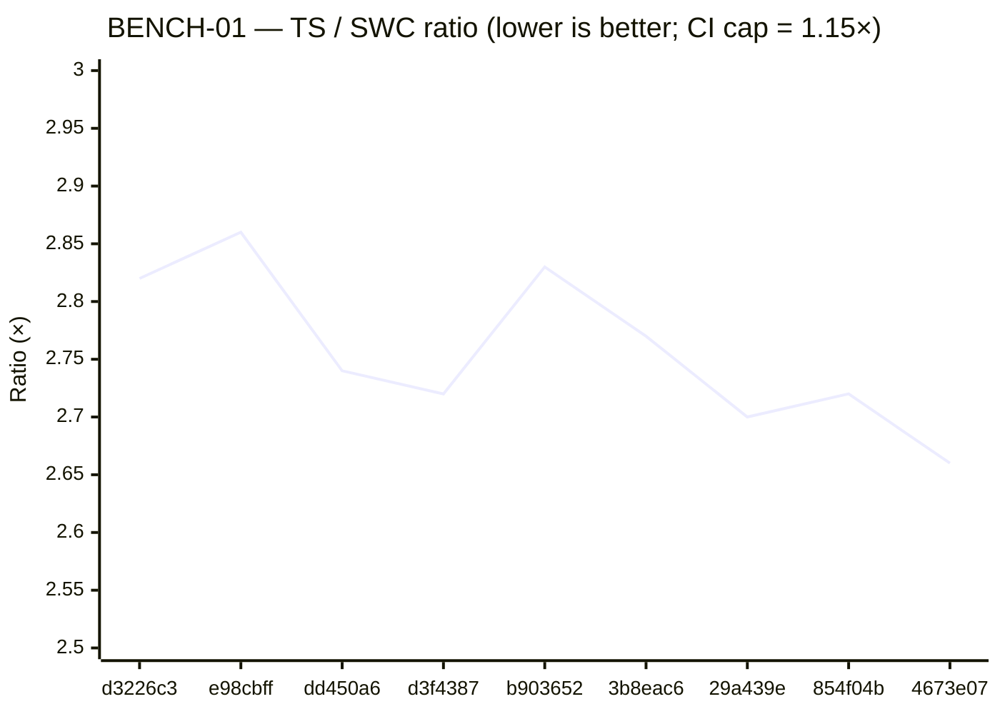
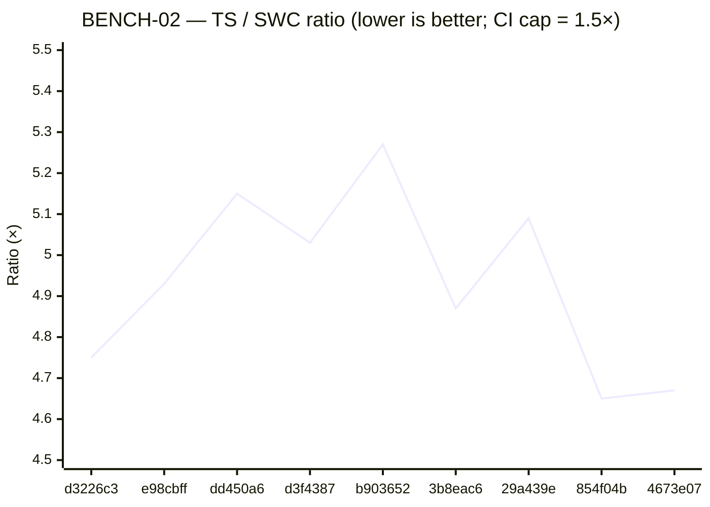

# Performance Benchmark History

Wall-time perf comparison of the TypeScript optimizer (this repo) against the SWC reference (`@qwik.dev/optimizer`'s NAPI binding). Use this doc to spot regressions and to track whether perf-targeted work is moving the needle.

The numbers come from `tests/benchmark/optimizer-benchmark.test.ts`. Append a row whenever you've shipped (or are about to ship) a change that could plausibly affect throughput.

---

## What's measured

Two benchmarks defined in `tests/benchmark/optimizer-benchmark.test.ts`, both running over real Qwik source:

| Benchmark | Input | Description |
|---|---|---|
| **BENCH-01** | `$QWIK_HOME/packages/**/*.{ts,tsx,js,jsx}` (excluding `node_modules`/`dist`/`.turbo`) — currently ~1391 files | "Whole monorepo" pass — exercises file-discovery + per-file batching cost |
| **BENCH-02** | `$QWIK_HOME/packages/qwik/src/core/tests/component.spec.tsx` — 3860 lines | Worst-case single file — a heavy component-spec that stresses extraction + segment generation |

Each benchmark warms up once, then takes the **min wall-time** across `MEASURED_RUNS = 2` measured runs. The `Ratio` column is `TS time ÷ SWC time`.

The current CI assertion caps are **1.15×** for BENCH-01 and **1.5×** for BENCH-02 — neither has been hit yet (see "Trend so far" below).

---

## How to add a new data point

1. Make sure the SWC reference binding is fresh:
   ```
   cd "$QWIK_HOME" && pnpm build.platform
   ```
   This rebuilds `$QWIK_HOME/packages/optimizer/bindings/qwik.<platform-arch>.node`. Skip if the qwik checkout hasn't moved since your last run.

2. From this repo:
   ```
   BENCH=1 pnpm vitest run tests/benchmark/optimizer-benchmark.test.ts --no-file-parallelism
   ```

3. Both benchmarks will print `SWC time:`, `TS time:`, and `Ratio:` lines. Both will assertion-fail (the caps haven't been met) — that's expected; the goal is to capture the numbers, not pass.

4. Prepend a row to each table below with: date, the merge SHA your numbers describe, a short workstream label, the three numbers, and any notes.

5. If your run targeted perf, append a one-line entry to the **"Trend so far"** section explaining what moved.

> **If the SWC binding was rebuilt against a different qwik commit since the last row,** note this in the Notes column. Both numerator and denominator change in that case, so SWC and TS times across rows are no longer apples-to-apples — only Ratio remains comparable.

---

## Methodology caveats

- **Numbers carry ~5–15% machine-state variance.** Running the same commit twice on the same machine produced 1465ms vs 1526ms on BENCH-01 (4% spread) and 91ms vs 96ms on BENCH-02 (5% spread). Don't read narrow row-to-row deltas as signal — only deltas that hold across multiple runs, or that exceed the variance band, mean anything.
- The reference SWC binding is rebuilt rarely; SWC times across rows are expected to be roughly constant at ~550ms for BENCH-01 and ~20ms for BENCH-02. **TS times are the meaningful axis.**
- Measurements are taken on `darwin-arm64` (Apple M-series). Other platforms will have different absolute timings — ratios should be roughly comparable. If you add a row from a different platform, mark it in the Notes column.
- The benchmark does *not* isolate CPU governor, freeze interrupts, or pin to performance cores. It's a quick wall-time check, not a microbenchmark. For perf-targeted work, run the benchmark several times and take the minimum.

---

## BENCH-01 — Full monorepo (~1391 files)

| Date | Commit | Workstream | SWC ms | TS ms | Ratio | Notes |
|---|---|---|---|---|---|---|
| **2026-05-09** | **`4673e07`** | **post #27 — current `main`** | 550 | 1465 | **2.66×** | post-OSS-355 + post-merge-routine codification |
| 2026-05-09 | `854f04b` | post #23 — OSS-354 | 557 | 1514 | 2.72× | closure-form `resolveConstLiterals` + prod-rename sync |
| 2026-05-08 | `29a439e` | post #22 — OSS-353 | 582 | 1571 | 2.70× | closure-node threading; per-extraction body re-parse dropped |
| 2026-05-08 | `3b8eac6` | post #18 — OSS-350 | 574 | 1589 | 2.77× | `preParsedModule` plumbing — single shared parse |
| 2026-05-08 | `b903652` | post #14 — OSS-346 | 571 | 1618 | 2.83× | `generateSegmentCode` 9-phase sequencer extracted |
| 2026-05-07 | `d3f4387` | post #11 — OSS-340 | 575 | 1567 | 2.72× | refactor v1 close — predicates module |
| 2026-05-07 | `dd450a6` | post #7 — OSS-341 | 574 | 1572 | 2.74× | CI infrastructure landed |
| 2026-05-07 | `e98cbff` | post #5 — F1 fix | 572 | 1635 | 2.86× | first TS optimizer code change — `_ref` indirection |
| 2026-05-06 | `d3226c3` | pre-code baseline | 553 | 1558 | 2.82× | "Group All Convergence Failures" — last commit before code work |

## BENCH-02 — Worst-case single file (`component.spec.tsx`, 3860 lines)

| Date | Commit | Workstream | SWC ms | TS ms | Ratio | Notes |
|---|---|---|---|---|---|---|
| **2026-05-09** | **`4673e07`** | **post #27 — current `main`** | 19 | 91 | **4.67×** | post-OSS-355 + post-merge-routine codification |
| 2026-05-09 | `854f04b` | post #23 — OSS-354 | 20 | 93 | 4.65× | closure-form `resolveConstLiterals` + prod-rename sync |
| 2026-05-08 | `29a439e` | post #22 — OSS-353 | 20 | 102 | 5.09× | closure-node threading; per-extraction body re-parse dropped |
| 2026-05-08 | `3b8eac6` | post #18 — OSS-350 | 20 | 98 | 4.87× | `preParsedModule` plumbing |
| 2026-05-08 | `b903652` | post #14 — OSS-346 | 19 | 102 | 5.27× | `generateSegmentCode` sequencer extracted |
| 2026-05-07 | `d3f4387` | post #11 — OSS-340 | 20 | 98 | 5.03× | refactor v1 close — predicates module |
| 2026-05-07 | `dd450a6` | post #7 — OSS-341 | 20 | 101 | 5.15× | CI infrastructure landed |
| 2026-05-07 | `e98cbff` | post #5 — F1 fix | 21 | 102 | 4.93× | first code change — `_ref` indirection |
| 2026-05-06 | `d3226c3` | pre-code baseline | 20 | 95 | 4.75× | pre-code baseline |

---

## Visual trend

Both charts plot **TS / SWC ratio** (the dimensionless regression signal — lower is better) across the same 9 commits the tables above describe, oldest → newest. The y-axes are intentionally narrow so within-noise movement is visible; widening them to start at 0 would flatten the trend and hide the ~10% spread.

### BENCH-01 ratio over time



### BENCH-02 ratio over time



> The CI caps (1.15× and 1.5×) sit well below the visible y-axis ranges and aren't drawn. Mermaid's `xychart-beta` doesn't support reference lines — caps stay textual in each chart's title. The tables above remain the source of truth; the charts are a visual aid.

---

## Trend so far

**Over the 4 days from 2026-05-06 → 2026-05-09 the TS optimizer is unchanged in perf within noise**, with one mildly suggestive recent uptick:

- **BENCH-01 TS time** moves between 1465 and 1635 ms (10% spread). The two most recent rows (854f04b, 4673e07) are the lowest two — both post-OSS-353/354, which both targeted the AST-walking hot path (closure-node threading and closure-form const-literal resolution). This is *consistent with* a real ~5–7% improvement, but barely above the variance band. Re-running each commit 3–5× would be needed to call it confidently.
- **BENCH-02 TS time** moves between 91 and 102 ms — same story, with the same two recent commits at the bottom of the range.
- **Ratios** (TS ÷ SWC) cluster at **~2.7×** for BENCH-01 and **~4.8×** for BENCH-02 — nowhere near the 1.15× and 1.5× CI caps.

**The refactor track was not perf-targeted.** Its goal was code-quality / structural cleanup to make subsequent feature work cheaper. The flat-with-a-hint-of-recent-improvement trend is the expected outcome — the underlying optimizer pipeline shape is largely unchanged.

To meaningfully move the ratios:

- BENCH-02 (worst-case file) is dominated by per-extraction work — that's where AST-walking optimizations like OSS-353's body-reparse drop should show up most. The numbers do hint at this; profiling would confirm.
- BENCH-01 is dominated by file-discovery + parsing across the batch. Throughput here is more about the parse → walk → emit cycle than any single phase.

When perf-targeted tickets get filed, link them here and add a row before/after each one to make the impact visible.

---

## Hardware / environment context

| | |
|---|---|
| Hardware | Apple M-series (`darwin-arm64`) |
| Node | ≥22 (per `package.json` `engines.node`) |
| pnpm | v10.x |
| SWC binding | `qwik_napi` v0.1.0 / `qwik-core` v2.0.0, `release` profile, built via `pnpm build.platform` from `$QWIK_HOME` |
| Qwik checkout | `$QWIK_HOME` ([`.claude/rules/GENERAL.md`](.claude/rules/GENERAL.md)) |

Future rows from different hardware should mark the platform in the Notes column. If the SWC binding has been rebuilt against a different qwik commit, also note that — only the Ratio column remains comparable across rebuilds.

---

## Methodology — backfilling history

This doc was bootstrapped on 2026-05-09 by checking out 9 historical commits in an isolated `git worktree`, replacing each commit's `tests/benchmark/optimizer-benchmark.test.ts` with the current portable version (older versions of the file had hard-coded paths and a different env-var contract that wouldn't run on a fresh machine), running `pnpm install --frozen-lockfile` per commit, and capturing the numbers.

The same procedure works for any future backfill. Don't try to backfill commits older than `d3226c3` — earlier commits predate the convergence-failures grouping work and the optimizer surface may diverge.
